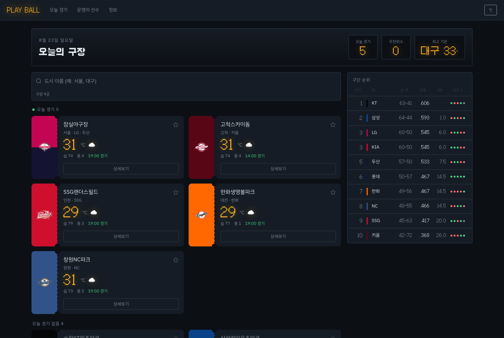
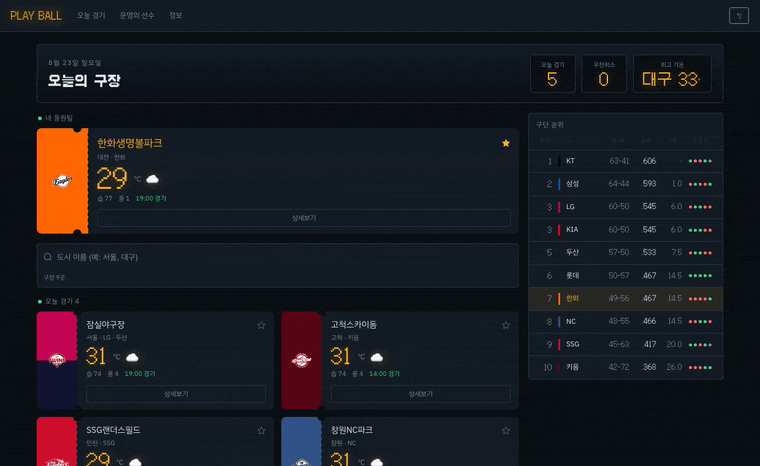
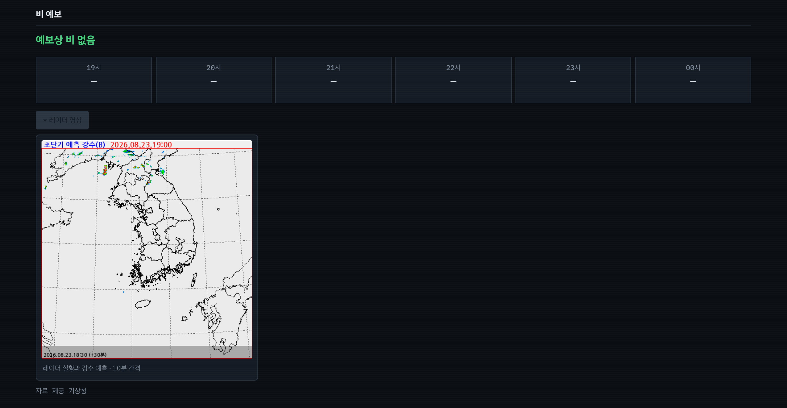
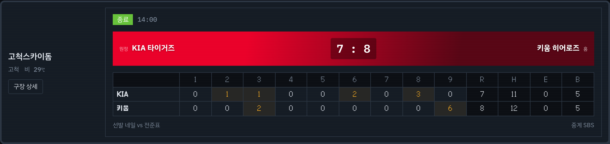
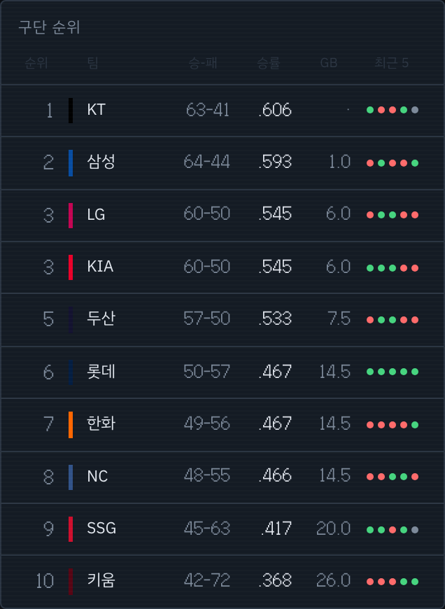
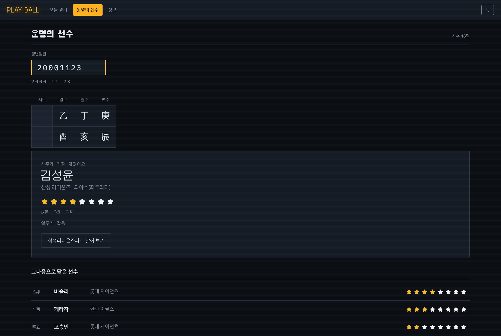
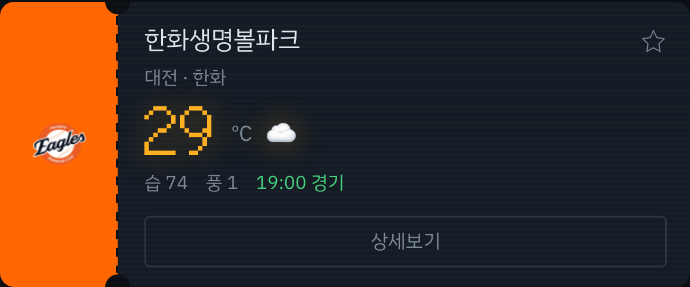
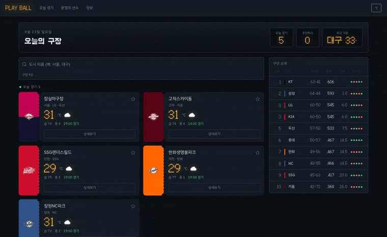

# PLAY BALL

> 오늘 야구 경기 볼 시간 없는데 ...

KBO 9개 구장의 날씨와 경기를 구장 전광판처럼 보여 주는 웹 앱이다.

|        |                                                 |
| ------ | ----------------------------------------------- |
| 배포   | https://skala-vue-ashen-three.vercel.app        |
| 프론트 | https://github.com/siamin20/skala-vue           |
| 백엔드 | https://github.com/siamin20/springboot-kbo-live |

SKALA 4기 6주차 / Frontend-framework : Vue.js

---

## 배경

과정 중에, 과제를 하느라 야구를 못 보게 된 적이 많았다.
맥북 위젯으로 실시간 야구 상황을 알려주는 위젯을 만들면 잘 쓸 수 있을 거 같아,
네이버 스포츠의 비공식 API를 찾아 호출하는 백엔드 시스템을 만들던 중이었다.

이 코드를 이번 Vue 수업에 활용/연결하여, 야구 보러 가기 전에
구장 날씨와 경기 상황을 한 화면에서 보는 웹을 만들어보았다.

또한 직관 가는 사람이 궁금한 건 기온도 중요하지만, 우천취소나 폭염취소에 대한 정보이다. 나는 항상 기상청 초단기예보를 찾아보고 경기를 보는데, 이 과정 또한 귀찮음을 해소하기 위해서 사이트에 불러오고 붙여보았다.

---

## 주요 기능

### 구장 목록

입장권 모양 카드로 오늘 날씨를 보여 준다.
경기가 있는 구장이 위, 없는 구장이 아래로 나뉜다.



별을 누르면 그 구장이 맨 위로 크게 올라오고, 순위표에서도 그 팀에 불이 들어온다.



### 비 예보

기상청 초단기예보로 경기 시각에 비가 오는지 본다.
3mm 이상이면 빨강, 그 아래면 노랑으로 티켓에 한 줄 붙는다.
상세 화면에서는 토글을 눌러 초단기강수예측 레이더 영상을 확인할 수 있다.



실제 우천취소는 그라운드 상태와 중계 일정을 고려하여 정해지기 때문에, 확실하게 미리 알 방법은 없지만 참고할 수 있도록 추가했다.

### 실시간 경기

이닝별 점수와 R, H, E, B, 선발 투수, 중계 채널을 구장 전광판처럼 그린다.
점수가 난 이닝은 불이 들어온다. 1분마다 새로 받아서 예정에서 진행으로 바뀌는 것도 따라갈 수 있도록 했다.



### 구단 순위

순위, 승패, 승률, 게임차, 최근 다섯 경기를 옆에 세워 뒀다.
최근 다섯 경기는 초록과 빨강 점으로 표시한다. (원래는 취소된 경기는 빼고 해야 하는데, 구현 편의 상 포함하고 그리도록 했다.)



### 운명의 선수

생년월일을 넣으면 사주 네 기둥을 세우고, KBO 선수 48명 중 닮은 순으로 찾아 준다.
원래는 궁합으로 할까 하다가, 내 사주가 어떤 선수랑 비슷한지 보여주는거로 바꿨다.
연주 / 월주 / 일주를 천간과 지지로 나눠 일치 개수를 센다.



---

## 화면

| 경로               | 화면                                   |
| ------------------ | -------------------------------------- |
| `/`                | 구장 목록, 내 응원팀, 구단 순위표      |
| `/weather/:cityId` | 비 예보, 레이더, 대기질, 이닝별 전광판 |
| `/games`           | 오늘 경기 전체                         |
| `/saju`            | 운명의 선수                            |
| `/about`           | 구장 목록, 데이터 출처                 |
| `*`                | 404                                    |

---

## 설계

### 데이터 분리

날씨만 나중에 실제 API로 바꾸면 되도록
`stadiums.js`(야구)와 `todayWeather.js`(날씨)로 나눴다.

### 3단계 폴백

`gameStore`는 실시간, 저장된 값, 목업 순으로 물러선다.
무료 호스팅은 잠들어 있다가 깨는 데 30초 이하로 걸린다.
그동안 화면이 비면 안 되니까 저장해 둔 값을 먼저 보여 주고, 응답이 오면 바꿔치기한다.

### 순차 호출

구장 아홉 곳의 날씨를 `Promise.all` 대신 하나씩 순서대로 받는다.
기상청 호출도 날씨와 다른 `try`로 나눠서, 기상청이 죽어도 기온과 미세먼지는 그대로 뜬다.

---

## 직접 구현

### 자체 KBO 백엔드

원래 맥북 위젯용으로 만들어 두었던 Spring Boot 서버를 이 앱에 붙였다.

| 엔드포인트             | 주는 것                                          |
| ---------------------- | ------------------------------------------------ |
| `GET /api/games/today` | 실시간 점수, 이닝별 전광판, 선발 투수, 중계 채널 |
| `GET /api/teams/rank`  | 구단 순위, 승률, 게임차, 최근 5경기              |
| `GET /api/saju`        | 만세력 조회                                      |

백엔드를 거치는 이유는 CORS다.
네이버 순위 주소는 `Origin` 헤더가 붙으면 403을 준다. 브라우저에서 직접 부를 수 없다.
사주도 같은 이유로, 만세력 사이트를 서버가 대신 불러오도록 하였다.

사주 네 기둥 중 일주는 날짜 계산으로 구할 수 있어서 앱에서 직접 만든다.
연주와 월주는 다르다. 해가 바뀌는 기준이 1월 1일이 아니라 입춘이고, 달도 절기를 기준으로 넘어간다.
절기 날짜는 해마다 달라서 만세력이 필요하다.

### 기상청 격자 좌표

기상청 API는 위경도가 아니라 격자 좌표(nx, ny)를 받는다.
람베르트 정각원추도법 변환식을 직접 구현해서 구장 9곳의 좌표를 계산했다.
공식 예제(서울 종로구 = 60, 127)와 값이 맞는 것을 확인했다.

### 초단기강수예측 레이더

날씨누리 영상을 ``로 가져온다.
파일 이름이 `qpr_YYYYMMDDHHMM.gif` 꼴이다. 10분 간격이고 약 20분 늦게 올라온다.
시각만 계산하면 되어서 백엔드를 거치지 않는다.

그래서 시각을 계산해 부르다 보면 아직 없는 파일을 부를 때가 있다.
이 서버는 없는 파일에도 200을 주면서 GIF 대신 에러 페이지 HTML을 내려준다.

는 HTML을 그림으로 못 읽고 오류를 내므로, 그 오류를 잡아서 10분 전 파일로 다시 시도하도록 했다.
80분까지 시도해보고, 그래도 없으면 영상을 출력하지 않는다.

---

## 디자인

구장 전광판을 본떴다. 검은 판, 앰버색 숫자, 구단 색은 입장권 스터브에만 보이도록 했다.
절취선 위아래를 반원으로 파내서 진짜 표처럼 보이게 했다.



처음에는 다마고치 모양 기계 안에서 캐릭터가 야구를 소개해주는 기획을 했었다.
그러나 화면의 60%를 다마고치 케이스가 먹어버리면서, 정작 야구 내용을 잘 표현하기 어려웠다.
그래서 전체 화면을 나타낼 수 있되 야구와 관련이 많은 전광판으로 우회했다.

도트 글꼴(Galmuri11)은 제목과 큰 숫자에만 사용했다. 작은 글씨에서는 도트 글씨가 두꺼워서 가독성이 떨어져 사용할 수 없었다.

입장권을 누르면 구단 색이 퍼지면서 상세로 넘어간다.



---

## 트러블슈팅

**경기 시각 하드코딩**
백엔드를 연결하기 전 화면 테스트용으로 목업 값을 박아뒀다.
후에 연결하고 나서도 목업 값으로 계속 같은 값이 나와, 백엔드 연결 문제로 오해했다.
티켓, 상세, 비 예보 판정 세 곳이 같은 값을 쓰고 있었다. 고척 낮경기(14:00)도 18:30으로 나왔다.
세 곳 모두 백엔드가 주는 실제 시각으로 바꿨다.

**버튼 글씨 대비 1.09**
따로 스타일을 지정하지 않은 버튼이 브라우저 기본값(흰 바탕, 검은 글씨)이라 대비가 1.09였고, 눈으로 확인할 수 없었다.
헤드리스 브라우저로 전 화면의 명암비를 재는 스크립트를 짜고, 전체 수정하였다.

**한글 조합 중 검색 누락**
`대구`를 쳐도 `대`로 검색됐다. 조합이 끝나야 값이 넘어오기 때문이다.
Element Plus의 `compositionupdate`를 받아서 해결했다.

**기상청 인증키 이중 인코딩**
발급받은 키가 이미 URL 인코딩된 상태였다.
axios `params`에 넘기면 `%`가 한 번 더 인코딩돼서 인증에 실패한다.
`params`를 쓰지 않고 주소 문자열에 키를 직접 붙여서 해결했다.

---

## 실행 방법

```bash
npm install
npm run dev
```

API 키는 `.env.local`에 넣는다. 변수 이름은 `.env.example` 참고.

```
VITE_OPENWEATHER_KEY=
VITE_KMA_KEY=
VITE_KBO_API_URL=
```

---

## 기술 스택

**프론트엔드** Vue 3.5 / Vite 8 / Vue Router 5 / Pinia 4 / Axios 1.19 / Element Plus 2.14
**백엔드** Spring Boot 4.1 / Java 21
**배포** Vercel (프론트) / Render (백엔드)

---

## 실습 단계별 코드

| 교재 Hands on       | 코드                                                                                                         |
| ------------------- | ------------------------------------------------------------------------------------------------------------ |
| Weather Mockup      | [src/data/](https://github.com/siamin20/skala-vue/tree/2577b54/src/data)                                     |
| Weather Composition | [WeatherHomeView.vue](https://github.com/siamin20/skala-vue/blob/2577b54/src/views/WeatherHomeView.vue#L126) |
| Weather Component   | [components/exercise/](https://github.com/siamin20/skala-vue/tree/2577b54/src/components/exercise)           |
| Weather Router      | [router/index.js](https://github.com/siamin20/skala-vue/blob/2577b54/src/router/index.js)                    |
| Weather Store       | [stores/](https://github.com/siamin20/skala-vue/tree/2577b54/src/stores)                                     |
| Weather Axios       | [api/](https://github.com/siamin20/skala-vue/tree/2577b54/src/api)                                           |
| Weather UI Library  | [SearchBar.vue](https://github.com/siamin20/skala-vue/blob/2577b54/src/components/exercise/SearchBar.vue)    |
| Weather Deployment  | [vercel.json](https://github.com/siamin20/skala-vue/blob/2577b54/vercel.json)                                |

검색박스와 리스트박스는 `BaseDashboardCard` 하나로 감싸고, 슬롯으로 `SearchBar` 와 `WeatherCard` 를 넣었다.
입장권은 눌러서 펼쳤을 때만 부모가 넣어 준 경기 정보를 보여 주는 슬롯을 하나 더 갖는다.

교재 1장 Modern JavaScript는 실습이 없지만 문법을 코드 전반에 썼다.
옵셔널 체이닝, 널 병합, 구조분해, 스프레드, property shorthand,
`Object.entries`, Array Methods, async / await.
코드: [api/kmaApi.js](https://github.com/siamin20/skala-vue/blob/2577b54/src/api/kmaApi.js)

---

## 자료 출처

기상청 초단기예보 / 초단기강수예측 (공공데이터포털, 이용허락범위 저작자 표시)
OpenWeatherMap
